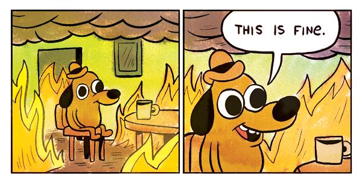

<!--
SPDX-FileCopyrightText: 2025 Taye Adeyemi <dev@taye.me>

SPDX-License-Identifier: AGPL-3.0-only
-->

# fine-jsx

A minimal JSX runtime with fine-grained reactivity intended for libraries with simple or complex UIs. Currently used by and developed for [Miru](https://miru.media/).



The idea is:

- JSX without React-style hooks
- Vue-like reactivity with `ref()`, `computed()`, `watch()` and `effect()`, but without `reactive()` proxies
- No virtual DOM
- Relatively small bundle size
- Can be applied to various platforms/engines/environments
- Requires only a JSX transpiler and no other specific build tools

# Example

```tsx
import { computed, ref } from 'fine-jsx'

import { useEditor, useElementSize, splitTime } from '/utils.ts'
// CSS modules with a bundler. Could also just use plain class strings
import styles from './styles.module.css'

// Components are just functions which may take props and return either a JSX element or a render function
export const Playhead = () => {
  // The component function may create refs and computeds as well as run watch()s and effect()s
  const interactiveEl = ref<HTMLElement>()
  // Like in Vue, "hooks" are just functions composing reactive values and effects
  const size = useElementSize(interactiveEl)

  const editor = useEditor()
  const timeParts = computed(() => splitTime(editor.doc.currentTime))

  return (
    <div
      inert
      class={styles.timelinePlayhead}
      // Element prop values can be refs or getters tracking reactive values
      style={() => `--time-pill-width: ${size.value.width}px`}
    >
      {/* Use a function as a JSX child, to re-render only that subtree on reactive updates */}
      {() =>
        editor.isMobileWorkspace ? (
          <span
            ref={interactiveEl}
            // classes can be arrays of reactive or static values
            class={[styles.timePill, styles.textBodySmall, styles.numeric]}
          >
            <span>{() => `${timeParts.value.hours}:${timeParts.value.minutes}`}</span>
            <span class={styles.timePillRight}>
              {() => `${timeParts.value.seconds}:${timeParts.value.subSeconds}`}
            </span>

            <svg class={styles.timePillDrop} viewBox="0 0 16 8">
              <path d="M7.99282 8C7.99282 ... 7.99282 8Z" fill="currentColor" />
            </svg>
          </span>
        ) : (
          <svg ref={interactiveEl} class={styles.timelinePlayheadHandle} viewBox="0 0 11 12">
            <path d="M0 2C0 0.895432 0.895431 ... 0 5.86249V2Z" fill="#FFFB24" />
          </svg>
        )
      }
      <div class={styles.timelineCursor} />
    </div>
  )
}
```

# TODO

- Tests
- Docs
- Debugging tools

## Funding

This project is funded through [NGI Zero Core](https://nlnet.nl/core), a fund established by [NLnet](https://nlnet.nl) with financial support from the European Commission's [Next Generation Internet](https://ngi.eu) program. Learn more at the [NLnet project page](https://nlnet.nl/project/Miru).

[](https://nlnet.nl)
[](https://nlnet.nl/core)
